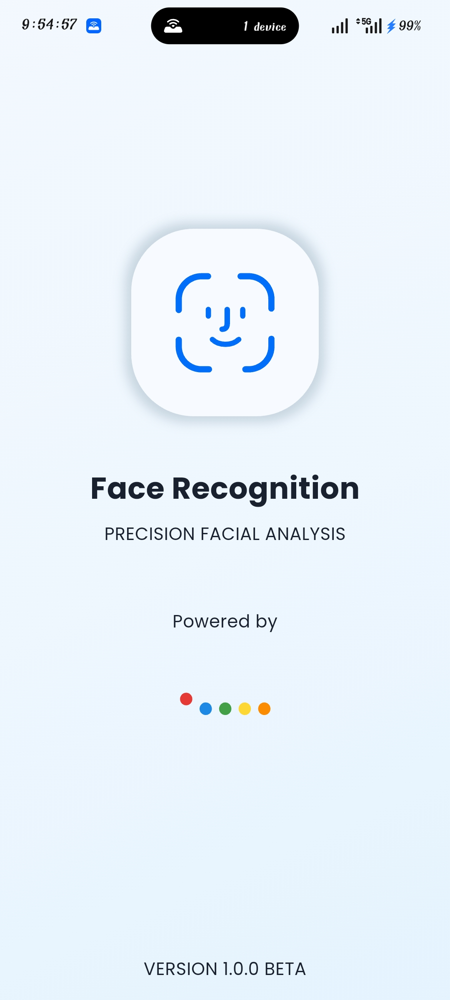
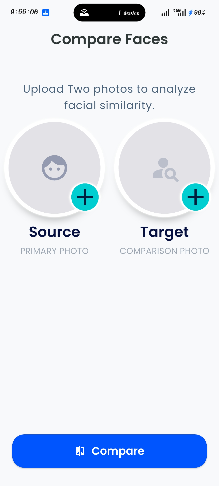
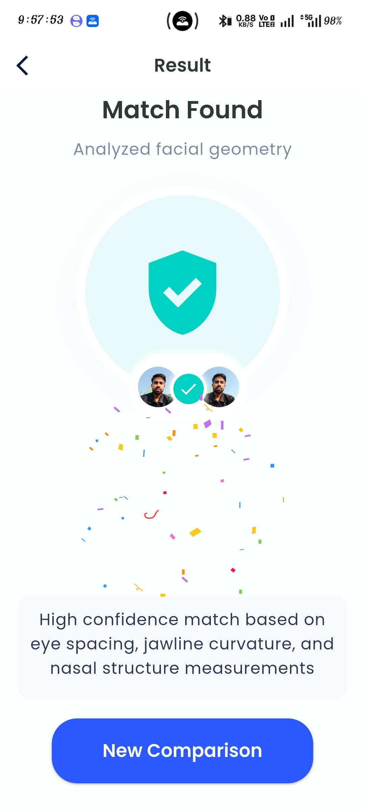
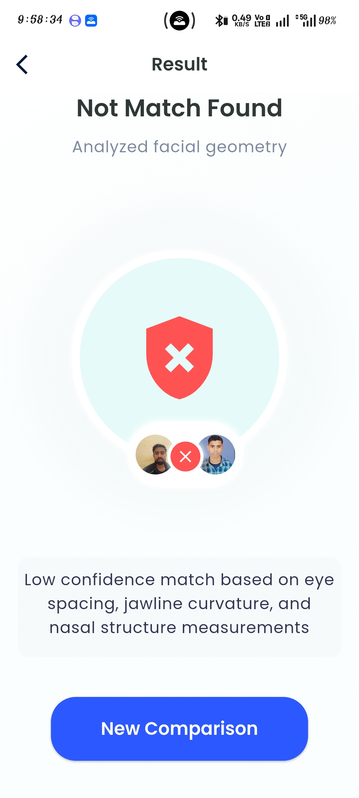

# 🚀 Face Recognition App (Flutter + AI)

A modern **Face Recognition Mobile Application** built using **Flutter** and powered by **TFLite (FaceNet model)**.  
This app compares two images and determines whether they belong to the same person with high accuracy.

---

## 🔍 App Preview

  
  
  
  

<i>Face Detection • Matching • Result Screen</i>

## ✨ Features

- 🔍 Face Detection from images
- 🤖 AI-based Face Matching (FaceNet TFLite)
- ⚡ Real-time comparison results
- 📊 Similarity score calculation
- 🧠 Lightweight on-device ML model (no server needed)
- 🎯 Clean and responsive UI
- 🧩 Feature-based architecture

---

## 🧠 How It Works

1. Select two images
2. Detect faces using ML model
3. Extract facial embeddings
4. Compare embeddings using distance metrics
5. Show result → **Match / Not Match**

> Face recognition systems generally work by detecting, analyzing, and comparing facial features to identify similarity between images :contentReference[oaicite:0]{index=0}

---

## 🛠️ Tech Stack

| Technology       | Usage |
|------------------|------|
| Flutter          | UI Development |
| Dart             | Programming Language |
| TFLite           | On-device ML inference |
| FaceNet Model    | Face embedding generation |
| GetX             | State Management |
| Clean Architecture | Scalable structure |

---

### 🧩 Structure Explanation

- **features/** → Core app modules (feature-based architecture)
- **binding/** → Dependency injection (GetX bindings)
- **controller/** → Business logic & state management
- **model/** → Data models
- **screens/** → UI screens
- **widgets/** → Reusable UI components
- **routes/** → Navigation management
- **utils/** → Common helpers & utilities
- **main.dart** → App entry point

---
## 👨‍💻 Author

**Ritesh Kumar**  
Flutter Developer | AI Enthusiast  

- 🔗 GitHub: https://github.com/riteshrawat999  
- 💼 LinkedIn: https://www.linkedin.com/in/ritesh-flutter
- 📧 Email: ritesh.flutter@gmail.com

---
